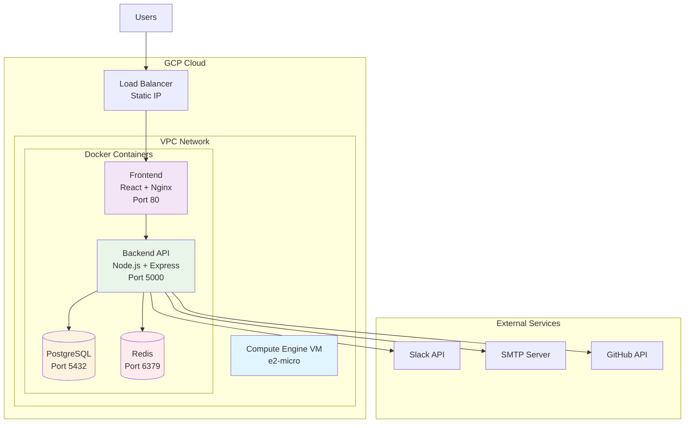

# CI/CD Pipeline Health Dashboard

A comprehensive real-time monitoring and alerting system for CI/CD pipelines, deployed on Google Cloud Platform using Infrastructure-as-Code (Terraform).

## 🚀 Live Demo

**Application URL**: `http://YOUR_VM_IP` (will be provided after Terraform deployment)  
**Status Page**: `http://YOUR_VM_IP/status`  
**API Health**: `http://YOUR_VM_IP/api/health`

## 📋 Table of Contents

- [Features](#-features)
- [Architecture](#-architecture)
- [Quick Start](#-quick-start)
- [GCP Deployment](#-gcp-deployment)
- [Local Development](#-local-development)
- [Live Metrics](#-live-metrics)
- [API Documentation](#-api-documentation)
- [Monitoring](#-monitoring)
- [Cost Optimization](#-cost-optimization)
- [Troubleshooting](#-troubleshooting)

## ✨ Features

### 🎯 Core Functionality
- **Real-time Pipeline Monitoring**: Live updates via WebSocket
- **Comprehensive Metrics**: Build times, success rates, failure analysis
- **Alert System**: Slack and email notifications
- **Interactive Dashboard**: Modern React-based UI with Tailwind CSS
- **Health Checks**: Automated service monitoring
- **Historical Data**: Pipeline performance trends

### 🔧 Technical Features
- **Microservices Architecture**: Backend API + Frontend SPA
- **Database Integration**: PostgreSQL with comprehensive schema
- **Caching Layer**: Redis for performance optimization
- **Containerized Deployment**: Docker Compose orchestration
- **Infrastructure as Code**: Terraform for GCP deployment
- **Auto-scaling Ready**: Designed for horizontal scaling

## 🏗️ Architecture



## 🚀 Quick Start

### Prerequisites
- Docker and Docker Compose
- Node.js 18+ (for local development)
- GCP account with billing enabled (for cloud deployment)

### Local Development

1. **Clone the repository**
```bash
git clone https://github.com/atulpandey1695/kra-assignment2.git
cd kra-assignment2/cicd-dashboard
```

2. **Install dependencies**
```bash
npm run install-all
```

3. **Start the application**
```bash
# Using Docker Compose (Recommended)
docker-compose up --build

# Or using npm scripts
npm run dev-full
```

4. **Access the application**
- Frontend: http://localhost:8080
- Backend API: http://localhost:5000
- Health Check: http://localhost:5000/health

## ☁️ GCP Deployment

### Automated Deployment with Terraform

1. **Configure GCP Project**
```bash
# Set your project ID
export PROJECT_ID="your-gcp-project-id"
gcloud config set project $PROJECT_ID

# Enable required APIs
gcloud services enable compute.googleapis.com
gcloud services enable container.googleapis.com
```

2. **Configure Terraform**
```bash
cd terraform
cp terraform.tfvars.example terraform.tfvars
# Edit terraform.tfvars with your project details
```

3. **Deploy Infrastructure**
```bash
terraform init
terraform plan
terraform apply
```

4. **Access Your Application**
```bash
# Get the public IP
terraform output public_url

# SSH into the VM (optional)
terraform output ssh_command
```

### Manual Deployment Steps

If you prefer manual deployment:

1. **Create GCP VM**
   - Machine type: e2-micro (Free Tier)
   - OS: Ubuntu 22.04 LTS
   - Boot disk: 20GB standard persistent disk

2. **Install Docker**
```bash
# On the VM
curl -fsSL https://get.docker.com -o get-docker.sh
sh get-docker.sh
sudo usermod -aG docker $USER
```

3. **Deploy Application**
```bash
# Clone repository
git clone https://github.com/atulpandey1695/kra-assignment2.git
cd kra-assignment2/cicd-dashboard

# Start services
docker-compose up -d
```

## 📊 Live Metrics

The dashboard provides real-time metrics through multiple channels:

### WebSocket Integration
- **Real-time Updates**: Pipeline status changes
- **Live Metrics**: Build times, success rates
- **Instant Notifications**: Alert delivery

### Metrics Collection
- **Pipeline Performance**: Build duration, success/failure rates
- **Resource Utilization**: CPU, memory, disk usage
- **Error Tracking**: Failure patterns and trends
- **Custom Metrics**: Business-specific KPIs

### Data Visualization
- **Interactive Charts**: Recharts-based visualizations
- **Real-time Dashboards**: Live updating widgets
- **Historical Analysis**: Trend analysis and reporting
- **Export Capabilities**: Data export in multiple formats

## 🔌 API Documentation

### Core Endpoints

| Endpoint | Method | Description |
|----------|--------|-------------|
| `/api/health` | GET | Service health check |
| `/api/pipelines` | GET | List all pipelines |
| `/api/pipelines/:id` | GET | Get pipeline details |
| `/api/metrics` | GET | Get performance metrics |
| `/api/alerts` | GET | List active alerts |
| `/api/alerts` | POST | Create new alert |

### WebSocket Events

| Event | Description |
|-------|-------------|
| `pipeline_update` | Pipeline status change |
| `metric_update` | New metric data |
| `alert_triggered` | Alert notification |
| `health_check` | Service health update |

### Example API Usage

```javascript
// Get all pipelines
fetch('/api/pipelines')
  .then(response => response.json())
  .then(data => console.log(data));

// WebSocket connection
const socket = io();
socket.on('pipeline_update', (data) => {
  console.log('Pipeline updated:', data);
});
```

## 📈 Monitoring

### Built-in Monitoring
- **Health Checks**: Automated service monitoring
- **Log Aggregation**: Centralized logging with Winston
- **Performance Metrics**: Response times, throughput
- **Error Tracking**: Exception monitoring and alerting

### External Monitoring
- **GCP Monitoring**: Cloud Monitoring integration
- **Custom Dashboards**: Grafana-compatible metrics
- **Alert Channels**: Slack, email, webhook support
- **Uptime Monitoring**: External service monitoring

### Monitoring Commands

```bash
# Check service health
curl http://YOUR_VM_IP/api/health

# View application logs
docker-compose logs -f

# Monitor resource usage
docker stats

# Check database status
docker-compose exec postgres pg_isready
```

## 💰 Cost Optimization

### GCP Free Tier Compliance
- **VM Instance**: e2-micro (1 vCPU, 1GB RAM)
- **Storage**: 20GB standard persistent disk
- **Network**: Standard tier (1GB egress free/month)
- **Static IP**: Free when VM is running

### Estimated Costs
- **Monthly Cost**: $0 (within Free Tier)
- **Additional Storage**: $0.04/GB/month (if needed)
- **Network Egress**: Free for first 1GB/month

### Cost Monitoring
```bash
# Check current usage
gcloud billing accounts list
gcloud billing budgets list

# Monitor costs
gcloud logging read "resource.type=gce_instance"
```

## 🛠️ Troubleshooting

### Common Issues

#### Application Not Accessible
```bash
# Check VM status
gcloud compute instances list

# Check firewall rules
gcloud compute firewall-rules list --filter="name~cicd"

# Check application logs
gcloud compute ssh --zone us-central1-a cicd-dashboard-vm --command="docker-compose logs"
```

#### Services Not Starting
```bash
# Check Docker status
systemctl status docker

# Check disk space
df -h

# Restart services
docker-compose restart
```

#### Database Connection Issues
```bash
# Check PostgreSQL logs
docker-compose logs postgres

# Verify database connectivity
docker-compose exec postgres pg_isready -U atulp -d testdb

# Check environment variables
docker-compose exec backend env | grep DB_
```

### Performance Optimization

#### Database Optimization
```sql
-- Check slow queries
SELECT query, mean_time, calls 
FROM pg_stat_statements 
ORDER BY mean_time DESC 
LIMIT 10;

-- Check table sizes
SELECT schemaname, tablename, pg_size_pretty(pg_total_relation_size(schemaname||'.'||tablename)) as size
FROM pg_tables 
ORDER BY pg_total_relation_size(schemaname||'.'||tablename) DESC;
```

#### Application Optimization
```bash
# Monitor resource usage
docker stats --no-stream

# Check memory usage
free -h

# Monitor disk I/O
iostat -x 1
```

## 🔐 Security

### Security Features
- **HTTPS Support**: SSL/TLS encryption
- **Rate Limiting**: API request throttling
- **Input Validation**: Request sanitization
- **CORS Configuration**: Cross-origin request handling
- **Security Headers**: Helmet.js security middleware

### Security Best Practices
- **Environment Variables**: Sensitive data protection
- **Database Security**: Connection encryption
- **Network Security**: VPC isolation
- **Access Control**: Service account permissions

## 📚 Additional Resources

### Documentation
- [Terraform Configuration](./terraform/README.md)
- [API Documentation](./docs/README.md)
- [Architecture Overview](./ARCHITECTURE.md)
- [Testing Guide](./TESTING_GUIDE.md)

### External Links
- [GCP Free Tier](https://cloud.google.com/free)
- [Terraform Google Provider](https://registry.terraform.io/providers/hashicorp/google/latest)
- [Docker Compose](https://docs.docker.com/compose/)
- [React Documentation](https://reactjs.org/docs)

## 🤝 Contributing

1. Fork the repository
2. Create a feature branch
3. Make your changes
4. Add tests if applicable
5. Submit a pull request

## 📄 License

This project is licensed under the MIT License - see the [LICENSE](LICENSE) file for details.

## 👥 Support

For support and questions:
- Create an issue in the repository
- Check the troubleshooting section
- Review the documentation

---

**Deployed on GCP with ❤️ using Terraform**
